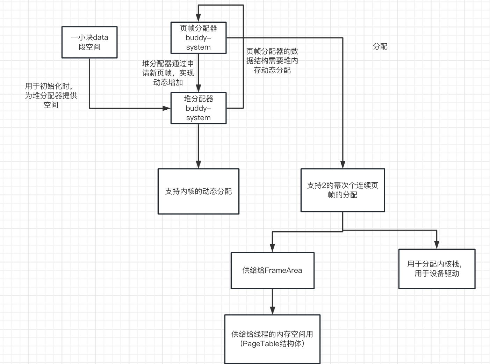

# Rift-OS

Rift-OS是[**2023全国大学生计算机系统能力大赛操作系统设计赛-内核实现赛**](https://os.educg.net/#/)的参赛作品，也是出于好玩和学习的目的进行开发的操作系统。

- 100% Rust
- 从零编写
- 多核
- RISC-V 64

## 项目结构

```shell
kernel/src 
├── arch
│   └── riscv
│       └── mod.rs #补充一些特定架构的函数，如cpu_id()
├── board
│   └── qemu.rs #板子特定参数，如时钟频率等
├── config.rs #大部分常数的定义
├── driver
│   ├── block_device
│   │   ├── mod.rs
│   │   └── virtio.rs
│   └── mod.rs
├── entry.asm #opensbi结束后会直接跳入该函数
├── fs 
│   ├── block_device.rs #将fat32接在virtio-driver的接口上
│   ├── fs.rs #文件系统上层
│   └── mod.rs
├── lang_items.rs #panic等
├── linker.ld 
├── main.rs #主函数，同时也是调度器线程
├── memory 
│   ├── address.rs #虚拟地址，物理地址，usize，虚拟地址页号，物理地址页号结构体以及他们的函数
│   ├── allocator #谢谢rcore的buddy-system
│   │   ├── frame.rs
│   │   ├── LICENSE.txt
│   │   ├── linked_list.rs
│   │   └── mod.rs
│   ├── frame.rs # FrameArea
│   ├── mod.rs # map_kernel,memory::init
│   └── page_table.rs 
├── proc
│   ├── elf.rs
│   ├── kthread.rs #主要是上下文，内核栈，以及线程切换的代码
│   ├── mod.rs
│   ├── scheduler.rs #全局调度器代码，GLOBAL_SCHEDULER , CURRENT_TID , IDLE_TID
│   ├── switch.asm 
│   ├── thread.rs 
│   └── uthread.rs #基本上就是trapframe
├── sbi.rs 
├── stdio.rs
├── syscall
│   ├── fs.rs
│   ├── mm.rs
│   ├── mod.rs
│   ├── other
│   │   ├── mod.rs
│   │   └── time.rs
│   ├── proc.rs
│   ├── syscall_num.rs
│   └── thread.rs
├── timer.rs
└── trap
    ├── interrupt.rs
    ├── mod.rs
    └── trap.asm
```


## 宗旨与整体现状

- 本着学术道德的原则，Rift-OS会完全如实地陈述系统中的我知道的所有缺点/bug以及不好的实现，也不会把其他人的工作说成是自己
- Rift-OS秉持和Arch Linux相似的理念，使用最新的依赖库，最新的rust版本，qemu版本，最新的opensbi，Rift-OS相信新的往往更好，除了
  - Rift-OS尝试适配virtio-driver最新版本但完全不可用，所以只能用rcore-tutorial使用的版本(虽然还是有bug)
  - fat32文件系统的库没有比较新的，因此Rift-OS只能选用较老的库(2021年)
- Rift-OS本意是尽量使用更好的技术尽量用更优美的实现写一个OS，虽然最后时间非常不足以及水平问题，导致：
  - 一部分代码(主要是最后赶工的部分文件系统和部分系统调用)写的有点屎山，之后我会花时间重新构思重新写文件系统，并且整理syscall的代码
  - 很多想法根本来不及实现(诸如copy-on-write，per cpu页表缓存，闲置cpu核心预先擦除页表内容之类的优化)
    - 你可以看到一些地方我留了空缺，比如Rift-OS是可以多核启动的，也可以多核调度，但是测例是串行的，Rift-OS远没有到能够利用多核来加速串行程序，因此目前没有开另外一个核心

- why rust?
  - 或许是时候问为什么不用rust了？
  - 权威：Linux支持rust提交，大量命令行基础工具用rust重写，windows用rust重写一部分代码
  - Rift-OS认为安全>性能，rust非unsafe保证内存安全，rust对于c只有很小的性能损失，事实证明，即使是最厉害的程序员(Linux内核贡献者)也经常在用C语言出现内存安全问题
  - 面向对象机制比较方便
  - rust有极为先进的包管理器，还有core库，省去造太底层轮子的麻烦
  - 正好学一学rust
  - 缺点：
    - rust和syscall参数不是很搭，(恐怖的Linux系统调用，怎么会有24位的数据类型)，(rust的char不等于u8)  (为什么C/C++的字符串要以\0结尾，这太不安全了)或者说，异想天开一点，也许可以研究一种新的syscall规范，char就是utf8而不是ascii，为什么一定要拘泥于C呢
    - 学习rust的成本

- 为什么从零开始
  - 比较炫酷
  - 这让我可以知道很多以前不知道的细节，比如启动的流程
  - xv6和rcore各有需要大刀阔斧的修改的缺陷，对于其他的操作系统，不太熟悉啦...
    - rcore不支持多核(单核改多核可不是单单换个Mutex这么简单)
    - xv6没有堆内存分配器，内核线程与用户线程使用不同的页表，xv6是C语言

## 运行

除了比赛官方的docker环境，Rift-OS在目前最新的Arch-Linux上一样可以完美运行

- Rust版本nightly-2023-03-29或更新
- QEMU7.0或更新

```shell
rustup target add riscv64imac-unknown-none-elf
rustup default nightly-2023-03-29 rustup component add llvm-tools-preview  rustup target add riscv64imac-unknown-none-elf cargo install cargo-binutils rustup target add riscv64imac-unknown-none-elf --toolchain nightly-2023-03-29 rustup component add llvm-tools-preview --toolchain nightly-2023-03-29
```

将比赛的sdcard.img置于项目目录下，运行比赛测例

```shell
make qemu
```

生成镜像

```shell
make all
```

## 完成度

(对于比赛要求的系统调用而言)


|                     | (基本)完整的实现功能(无论性能) | 不完整的实现 | 可以算是作弊的实现(骗分) | 没有实现 | 备注                                                         |
| :-----------------: | :----------------------------: | :----------: | :----------------------: | :------: | ------------------------------------------------------------ |
| **文件系统syscal**l |                                |              |                          |          |                                                              |
|     sys_getcwd      |            &#10004;            |              |                          |          |                                                              |
|      sys_pipe2      |                                |              |                          | &#10004; | 没有考虑过如何实现                                           |
|       sys_dup       |            &#10004;            |              |                          |          |                                                              |
|      sys_dup3       |            &#10004;            |              |                          |          |                                                              |
|      sys_chdir      |            &#10004;            |              |                          |          |                                                              |
|     sys_openat      |                                |   &#10004;   |                          |          | 文件所有权未实现，访问模式实现残缺                           |
|      sys_close      |            &#10004;            |              |                          |          |                                                              |
|   sys_getdents64    |                                |              |                          | &#10004; | 一天以内可以实现                                             |
|      sys_read       |            &#10004;            |              |                          |          |                                                              |
|      sys_write      |            &#10004;            |              |                          |          |                                                              |
|     sys_linkat      |                                |              |                          | &#10004; | 不知道怎么实现，完整的实现应该在下次启动仍然存在链接(查阅资料并编写，工作量在一周以内) |
|    sys_unlinkat     |                                |              |                          | &#10004; | 同上                                                         |
|     sys_mkdirat     |            &#10004;            |              |                          |          |                                                              |
|     sys_umount2     |                                |              |         &#10004;         |          | return 0 骗分，下同                                          |
|      sys_mount      |                                |              |         &#10004;         |          | 没有相应的数据结构支撑，一个能够工作但不好的实现工作量在两天左右 |
|      sys_fstat      |                                |              |                          | &#10004; | 不了解该系统调用                                             |
| **进程管理syscall** |                                |              |                          |          |                                                              |
|      sys_clone      |                                |   &#10004;   |                          |          | 会忽视后三个参数                                             |
|     sys_execve      |                                |              |                          | &#10004; | 该有的数据结构都有，一天之内的工作量                         |
|      sys_wait       |            &#10004;            |              |                          |          | 不会理会option，讲道理应该用信号量实现，但目前使用的是用vec记录子线程的tid，死等+yield等到子进程exit |
|      sys_exit       |            &#10004;            |              |                          |          |                                                              |
|     sys_getppid     |            &#10004;            |              |                          |          |                                                              |
|     sys_getpid      |            &#10004;            |              |                          |          |                                                              |
|       sys_brk       |                                |              |         &#10004;         |          | brk的值初始化为栈段以外的地址最大的段段尾，之后的调用只是在修改和查看brk的值，不会真正的分配或者回收内存 |
|     sys_munmap      |                                |              |                          | &#10004; | 不知道怎么实现，缺乏大量相关数据结构(查阅资料并编写，工作量在一周以内) |
|      sys_mmap       |                                |              |                          | &#10004; | 同上                                                         |
|   **其他syscall**   |                                |              |                          |          |                                                              |
|      sys_times      |            &#10004;            |              |                          |          |                                                              |
|      sys_uname      |            &#10004;            |              |                          |          |                                                              |
|   sys_sched_yield   |            &#10004;            |              |                          |          |                                                              |
|  sys_gettimeofday   |            &#10004;            |              |                          |          | 可能值的倍率有问题                                           |
|    sys_nanosleep    |            &#10004;            |              |                          |          |                                                              |

## 各个模块

### 内存管理



#### 堆分配器与页帧分配器

- 堆分配器和页帧分配器使用的是经过修改的依赖库（修改的部分让堆分配器可以接在页帧分配器上，并且动态扩充内核堆空间）

- 特点：

  - 只能分配**2的幂个连续的页帧**，只能分配2的幂字节大小的堆空间
  - 由于堆分配器是动态向页帧分配器索取空间，因此不用像rcore一样，必须在data段划一大片够用的空间给堆分配器，造成浪费
    - 堆空间虽然**可以动态增加**，但是动态减少，或者说**回收，还未实现**

  - 堆分配器使用侵入式链表，页帧分配器使用非侵入式的BTree

- 初始化顺序：使用data段的一小块空间初始化堆分配器，借助堆分配器初始化页帧分配器，重映射内核空间

- 页帧的回收由rust的drop机制自动执行，防止double free或者内存泄露的可能。

#### 地址

- 地址类型数据结构设计与rcore类似，rcore在使用VirtAddr上更加规范，Rift-OS在表示虚拟地址时，混合使用VirtAddr和usize，有些混乱

#### 映射

- Rift-OS对于物理内存的访问使用线性偏移映射
- Rift-OS将内核空间映射到高地址，用户空间使用低地址，即内核空间和用户空间使用同一张页表
  - 性能：陷入内核时无需切换页表，清空TLB是巨大的开销
  - 方便：无需切换页表使得编写trap还变得容易了一些
  - 安全？以前曾经发生过melt down的安全漏洞，但Rift-OS认为这类漏洞应该由硬件解决，而非操作系统(实际上，10代还是11代酷睿开始，就没有这个漏洞了)

- 类似常见的设计，Rift-OS在entry.asm中，粗略的映射内核空间，然后在初始化内核空间的**重新按照标志位逐页精细映射**
  - 逐页指的是以4K为一页
  - 有待优化：线性偏移映射完全可以用大页(1G或2M)

#### 页表

- 页表主要由一个root_ppn和一个vec< FrameArea >组成，root_ppn指示页表的根地址，vec中包含该地址空间中的每个地址段，对于无需释放的地址段(如内核代码段)，通过FrameArea中的一个标志位指示

### 进程/线程管理

- Rift-OS的进程，线程概念和Linux相似，两者几乎是一个东西
- Rift-OS使用一个加锁的全局数组CURRENT_TID指示当前运行在第i个cpu上的是哪个线程号，类似的有一个IDLE_TID加锁全局数组指示第i个cpu上调度器线程号
- Rift-OS的tid与线程一一对应，有一个全局的加锁线程池数组(存线程结构体)，另外有一个全局的加锁调度器队列(队列存Tid不存线程结构体)，通过tid，可以唯一的找到想要的线程
  - 调度器线程在线程池里，但不会进调度队列
- 如果打开多核启动，则机器有多少个核心，就有多少个调度器线程
- 在运行测例下，只有调度器线程是“单独的内核线程”，其他线程都是一个用户线程和一个内核线程捆绑起来的，Rift-OS支持单独的内核线程

### 线程切换

- Rift-OS的线程切换汇编部分直接使用老版rcore汇编(大概其实有栈切换都是大同小异)
- 调度器使用switch_to来切换到其他线程，其他线程通过yield_()来出让
- 调用yield_前必须保证没持有锁
- yield_最后也会调用switch_to，假如a线程切换到b线程，a线程首先会持有a，b线程两把锁，切换到b线程后，b来释放这两把锁(不同于xv6，xv6仅获得b线程一把锁)

### 陷入(trap)

- Rift-OS的trap汇编也直接使用老版rcore汇编，有修改
  - Rift-OS在首次进入某一线程时，会进入_firstret而非rcore的__trapret，firstret首先进入forkret，在这里可以用rust做一些事，然后再进入trapret来进入用户空间
  - 之后的trap，trapret，Rift-OS与rcore别无二致
  - rcore将contextcontent和trapframe放在一块，但Rift-OS认为这一个是给内核线程用的，一个是给用户线程用的，不应该放在一起，因此Rift-OS将他们分别拆到了KThread和 UThread结构体中，但是他们都会被压进内核栈

### 驱动

- 驱动使用rcore的virtio-driver，仍然存在严重bug(见bug节)

### 文件系统

#### 下层

- 文件系统使用依赖库fat32
  - 为什么不使用rust-fatfs：
    - rust-fatfs不能直接在当前rust版本下运行，修改依赖库工作量较大
    - rust-fatfs虽然不像fat32 21年停止开发，但其核心部分其实也是于21年就停止开发
    - rust-fatfs结构比较复杂，文件系统是我的弱项，我希望使用我看的明白的依赖库

- 修改，添加功能
  - 添加了路径检查，ls，get_name等

#### 上层

- FileInner结构体保存fat32中的Dir或File结构体，另外有标志位指示打开的模式是什么(目前只实际支持区分追加写入/截断写入)，充当类似inode的作用
- 线程结构体中通过Vec< FileInner>来记录文件描述符对应的是哪个文件/目录
- 对于绝对路径，Rift-OS从根目录开始寻找。对于从cwd开始的相对路径，Rift-OS将其与cwd拼接成绝对路径然后寻找。对于文件描述符开始的相对路径，Rift-OS从文件描述符对应的dir或File开始寻找
- 所以，Rift-OS的文件系统上层其实只有文件描述符表和当前路径字符串两种数据结构，其他什么都没有，因此syscall的表中表示实现mount，链接很困难

### ELF解析

- Rift-OS借助xmas-elf库进行解析
- 解析后，分配相应的段到pagetable中，然后再为其分配一个用户栈段。

### syscall

- Rift-OS会检查用户传进来的参数是否合法

## Bug和解决

### 还没解决的bug

1. Rift-OS的virtio驱动有很严重的bug，目前在本机环境和docker环境下，大概有1/50的概率触发，云平台上似乎更高一些
   - 启动后第一次IO读写可能会直接ERROR，但如果第一次读写没ERROR，则之后不会再ERROR
   - 原因：未知，没能成功定位bug具体位置，也不确定到底是Rift-OS的问题还是引用的virtio-driver的问题
     - 已经排除了race condition或者编译器优化指令重排导致的，但是因为我不会写驱动，所以没法研究下去了
   - 虽然没有定位到，但是我很肯定是驱动的bug而不是文件系统的bug
2. Rift-OS在以调试模式构建的情况下，在运行read测例时会panic
   - 由于不影响release构建，我暂时没有去查明原因
3. 由于syscall是赶工赶出来的，他们虽然跑过了测例，但里面很有可能有什么隐含的bug，但是应该没有特别严重的bug

### 解决过的各种神奇bug还有弯路

(有些年代久远我真的不记得了)

1.virtio-driver 0.4.0，我用与当前版本的virtio-driver逻辑完全一样的代码，完全跑不起来。

2.debug build和release build行为不一致。(可能记错)，好像有两次，明明是另外一个部分panic，release却错误的显示了不同的panic。

- 这件事和virtio驱动结合起来，导致我好几次明明看到virtio panic却以为是其他地方出bug了，对着好的代码看了半天

3.曾经卡了我一天的非常愚蠢的bug，关于0xffffffffc0201358和0xffffffc999999999在不同的位置打印，于是后者看起来“明显”比前者大，后来我就学会了一件事，先数是6个f还是8个f

4.各种因为rust不熟而导致过编译真累的事情，还有什么特别长的单行欢乐代码

```rust
switch(&mut self.context_addr,&mut THREAD_POOL.get_mut().pool[target_tid].lock().as_mut().unwrap().thread.kthread.context_addr));
```

5.map了kernel代码段，结果kernel代码段没有不释放标记，于是drop的时候kernel代码段整个都欢乐的被Frame Allocator吃掉了

6.调试多核调度的时候：a调度器调了b线程，b线程yield到a调度器，下一次是c调度器去调b线程，由于rust的隐形drop，于是b线程错误的解锁了a和b线程的锁(应该是b和c)

7.傻乎乎的一个个把依赖下到本地然后手动改Cargo.toml为依赖路径，下了十几个，发现依赖的依赖还有20个，遂发现居然还有cargo vender这种神器

8.内核栈爆栈，遇到过一次，但是我猜出来了，一会就修好了(由于Rift-OS没有在内核栈边界设置guard page，所以发生爆栈没有直接反馈)

9.死锁bug多了去了。。。一般都是不小心自己lock了两次

10.opensbi编译出来2.1MB，居然会超出0x80200000 导致qemu加载sbi和elf提示区域重叠，于是机智的我直接切割sbi的二进制文件至2MB(后面扔掉)

(话说我看到有的队的opensbi才700K，这是老的吗，还是用什么编的，因为我分别用最新的gcc和clang，编出来都是2.1MB)

## 以后

如果按去年入围30队结合Rift-OS的憨批排名，还有恐怖的区域划分，Rift-OS应该是难以入围决赛了😭，但是不打比赛也可以接着改嘛，无论进入决赛与否，接下来Rift-OS的开发计划是：

1.找到另外一个可用的驱动把virtio-driver替换掉，没有就自己写

2.全面整理文件系统和系统调用的那些赶工代码(其实用不了几天)

3.学习一下vfs，看看怎么加进来

4.上早就想好了的优化！

## 为什么Rift-OS没有做到理想

- 首先一开始确实有点懒，完全一个人孤军奋战外加从0编写即使添加了很多依赖库仍然工作量较大(相比从xv6或者rcore直接改)
- os编写经验不足，对工作量的计算很不准确，导致时间分配有问题(很多模块第一次编写就以为全部完事了，结果最后写系统调用发现还得加)
- 我得承认我对于软件工程和设计模式的理解非常欠缺，也没有编写中大型项目的经验
- 文件系统是弱项，驱动一窍不通
- rust不熟练(但如果用c的话，调库麻烦可能反而工作量更大)
- xv6和rcore看的太多了，Linux看的太少了(看也是看的古早2.6)，说白了就是更好的设计结构，优化手段见得少
- 还是菜


## 项目人员以及致谢

整个内核设计，代码编写，测试调试完全由谢澄一人完成。

指导老师：冯国富

### 依赖

依赖库为我省去了很多工作，感谢他们的开源工作

- [riscv](https://docs.rs/riscv/latest/riscv/)

- [spin](https://docs.rs/spin/0.9.8/spin/)
- [lazy_static](https://docs.rs/lazy_static/1.4.0/lazy_static/)

- [bitflags](https://docs.rs/bitflags/2.3.1/bitflags/)
- [virtio-drivers](https://docs.rs/virtio-drivers/0.4.0/virtio_drivers/) 轻微修改
- [fat32](https://docs.rs/fat32/0.2.0/fat32/) 有修改
- [xmas-elf](https://docs.rs/xmas-elf/0.9.0/xmas_elf/)

- [buddy-system-allocator](https://github.com/rcore-os/buddy_system_allocator) 有修改 位于kernel/src/memory/allocator/

### 致谢

(排名区分先后)

- 非常感谢mit的6.s081，它让我第一次一窥操作系统内核，感受到编写内核的挑战性和趣味
- 感谢rcore-tutorial，Rift-OS最初的开发很大程度上参考了rcore
- 感谢南京大学jyy，哦豁，你的计组和OS课很炫啦，有很多其他正经课看不到的新东西(真希望哪天可以入你门下(想peach))
- 感谢去年的FTL OS，你们的工作非常的炫酷，许多技术我闻所未闻，让我大开眼界
- 感谢去年的Maturin，我在调研内核设计的时候，好多次查看了你们的项目
- 感谢今年的BiteTheDisk，（虽然其实是竞争对手）在最后的赶工环节，仔细阅读linux manual有时不太来得及，因此有几个syscall的参数含义我是查看你们的实现来了解的，还有一点最重要的，我真的不知道奇妙C语言居然还有24位的数据，还好看了你们的sys_wait里面有个移动8位我才发现
